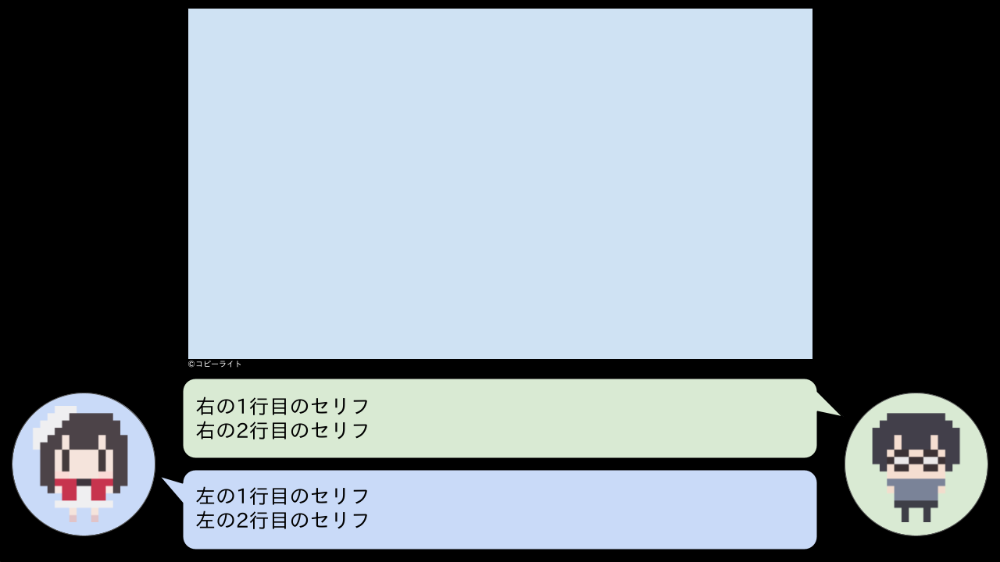

# saeota

[冴えないオタクの育て方](https://www.youtube.com/channel/UCIGVbFbnW53enmepcmWE4QQ)の動画用の画像を生成します。

## Get started

```shell
$ go install github.com/roronya/saeota@latest # install
$ saeota -f figure.png -l 左の1行目のセリフ -l2 左の2行目のセリフ -r 右の1行目のセリフ -r2 右の2行目のセリフ > out.png # usage
```



## 解説対象のpngについて

900px x 450px であることを想定しています。

### iPadでスクリーンショットを撮ってsaeotaの入力する場合

ImageMagickでリサイズしてクロップすると簡単です。

```shell
$ convert -resize 800x600 input.png resized.png
$ convert -crop 800x450+0+75 resized.png croped.png
```

## Output

アウトプットはPNGで解像度は1280px x 720pxです。

このサイズはサムネで推奨されているサイズでもあるし、720pで再生できるサイズです。

see:ref

[動画の解像度とアスペクト比 - パソコン - YouTube ヘルプ](https://support.google.com/youtube/answer/6375112?hl=ja&co=GENIE.Platform%3DDesktop)

[動画のサムネイルを追加する - YouTube ヘルプ](https://support.google.com/youtube/answer/72431?hl=ja#zippy=,%E7%94%BB%E5%83%8F%E3%82%B5%E3%82%A4%E3%82%BA%E3%81%A8%E8%A7%A3%E5%83%8F%E5%BA%A6)

## Author

@roronya

## LICENCE

Apache v2.0
